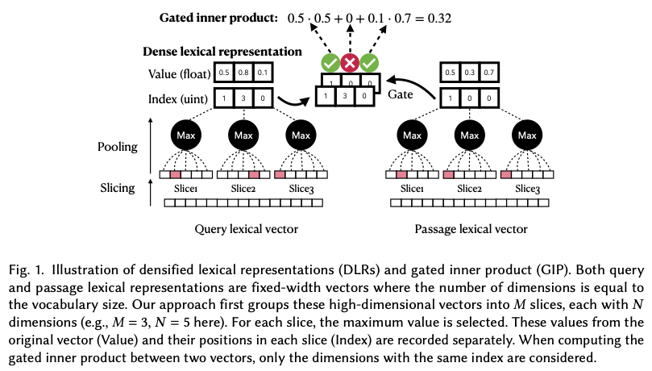
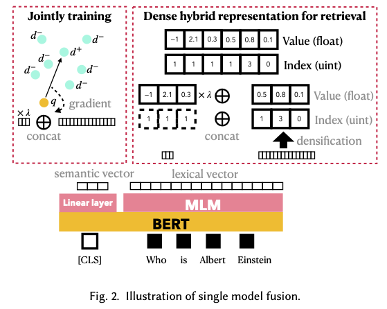

# Dense Hybrid Search
The repo contains the code for our paper:
*[A Dense Representation Framework for Lexical and Semantic Matching](https://arxiv.org/abs/2206.09912)* Sheng-Chieh Lin and Jimmy Lin. 
This repo contains three parts: (1) densify (2) training (tevatron) (3) retrieval . 

Our training code is mainly from [Tevatron](https://github.com/texttron/tevatron) with a minor revision.

## Requirements
```
pip install torch>=1.7.0
pip install transformers==4.15.0
pip install pyserini
pip install beir
```
# Dense Lexical Retrieval



We can densify any existing lexical matching models and conduct lexical matching on GPU. In the [document](https://github.com/jacklin64/DHR/blob/main/docs/densify_exp.md), we demonstrate how to conduct BM25 and uniCOIL end-to-end retrieval under our framework. Detailed description can be found in our [paper](https://arxiv.org/pdf/2112.04666.pdf). 

# Dense Hybrid Retrieval
With the densified lexical representations, we can easily conduct lexical and semantic hybrid retrieval using existing neural models. A document for hybrid retrieval will be coming soon.

# Dense Hybrid Representation Model



In our paper, we propose a single model fusion approach by training the lexical and semantic components of a transformer while inference, we combine the densified lexical representations and dense representations as dense hybrid representations. Instead of training by yourself, you can also download our trained [DeLADE-CLS-P](https://huggingface.co/jacklin/DeLADE-CLS-P), [DeLADE-CLS](https://huggingface.co/jacklin/DeLADE-CLS) and [DeLADE](https://huggingface.co/jacklin/DeLADE) and directly peform inference on MSMARCO Passage dataset (see [document](https://github.com/jacklin64/DHR/blob/main/docs/msmarco-passage-train-eval.md)) or BEIR datasets (see [document](https://github.com/jacklin64/DHR/blob/main/docs/beir-eval.md)).
